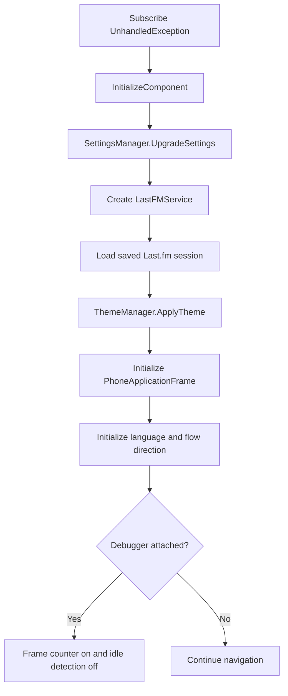

# Application lifecycle and navigation

`App` is the Silverlight application entry point declared by `SilverlightAppEntry` in the project file. `WMAppManifest.xml` points the default task at `MainPage.xaml`.

## Startup order

The `App` constructor performs these operations synchronously:

`InitializeComponent()` loads the global XAML resource dictionary, including localized resources and visibility converters.

## Root frame initialization

`InitializePhoneApplication()` is guarded by `phoneApplicationInitialized`. It:

1. creates `PhoneApplicationFrame`;
2. subscribes `CompleteInitializePhoneApplication` to its first navigation;
3. subscribes navigation failure handling;
4. subscribes reset-navigation handling; and
5. stores it in static `RootFrame`.

On first navigation, `CompleteInitializePhoneApplication` assigns `RootVisual` and detaches itself.

## Reset navigation

When a navigation event has `NavigationMode.Reset`, `CheckForResetNavigation` subscribes a one-shot `ClearBackStackAfterReset`. After the next New or Refresh navigation, that handler repeatedly calls `RootFrame.RemoveBackEntry()` until the back stack is empty.

This prevents navigation back into a pre-reset flow.

## Page navigation

| From | Action | Destination |
|---|---|---|
| Main | Settings menu | `/SettingsPage.xaml` |
| Main | Scrobble stats menu | `/StatsPage.xaml` |
| Settings About | Visit stats page | `/StatsPage.xaml` |
| Any child page | Hardware/software Back | Previous journal entry |

Pages call `NavigationService.Navigate` with relative URIs. No query parameters are used.

## Activation, deactivation, and closing

`Application_Launching`, `Application_Activated`, `Application_Deactivated`, and `Application_Closing` exist and are connected through `PhoneApplicationService`, but their bodies are empty.

Consequences:

- no explicit transient player/scrobble state is saved during deactivation;
- no service disposal occurs on close;
- no navigation state is restored by application code; and
- behavior on tombstoning relies on Silverlight/platform page-state handling and isolated settings.

`LastFMService` session persistence occurs only after successful session exchange. Regular settings save immediately in each setter.

## Page navigation hooks

### `MainPage.OnNavigatedTo`

Refreshes only the scrobble status label. It does not reload the music library or recreate the player.

### `SettingsPage.OnNavigatedTo`

Reloads controls from settings, updates account status, and re-enables token buttons when the token text box is non-empty.

### `StatsPage.OnNavigatedTo`

Reloads only recent tracks. Top lists were loaded in the constructor or through refresh/period buttons.

## Error hooks

- Navigation failure calls `Debugger.Break()` only when attached.
- Unhandled application exceptions call `Debugger.Break()` only when attached.
- Neither handler marks an exception handled or presents a production error page.

## Language setup

`InitializeLanguage()` assigns `RootFrame.Language` from `AppResources.ResourceLanguage` and parses `ResourceFlowDirection` as a `FlowDirection`. Any error is rethrown after a debugger break, so invalid resource values are startup-fatal.

## Lifetime risks

- `AudioPlayerService` subscribes static `MediaPlayer` events and implements `Dispose`, but `MainPage` never calls it.
- The progress timer is not stopped during navigation/deactivation.
- Network callbacks have no cancellation and can complete after navigation.
- Empty app lifecycle hooks do not compensate for process tombstoning.

Any lifecycle hardening should define ownership first: page-level services can clean up in `OnNavigatedFrom`, while app-wide playback would require moving ownership to `App` or a dedicated background/audio architecture.
