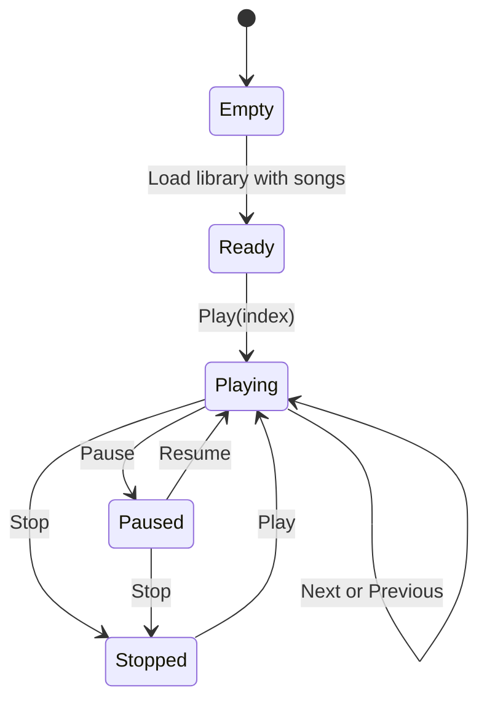

# Audio playback architecture

`AudioPlayerService` is an instance facade over the static XNA `MediaPlayer` and a per-instance `MediaLibrary`.

## State

```csharp
private List<Track> _playlist;
private int _currentIndex;
private bool _isShuffled;
private Random _random;
private bool _isPlaying;
private MediaLibrary _mediaLibrary;
private bool _disposed;
```

Construction initializes an empty list, index `-1`, shuffle/playing false, and subscribes:

- `MediaPlayer.MediaStateChanged` → `OnMediaStateChanged`
- `MediaPlayer.ActiveSongChanged` → `OnActiveSongChanged`

## Loading tracks

`LoadSongsFromMusicLibrary()` clears state and enumerates songs sorted by artist then name. Each item becomes a new `Track` with defensive property reads.

The method contains a reflection-based attempt to access album art:

1. inspect `song.Album` for an `Art` property;
2. invoke `GetImage`;
3. create a `BitmapImage` and set its source.

The resulting bitmap is not retained, so this work has no visible output.

If at least one item exists, `_currentIndex` becomes zero, but playback does not start.

## Control flow



The service's `_isPlaying` mirrors requested state and is also synchronized from `MediaPlayer.State` on media state changes.

## Events

| Event | Raised when |
|---|---|
| `TrackChanged` | `Play()` begins successfully, or XNA reports a recognized active song |
| `PlayStateChanged` | Play/Pause/Resume/Stop or XNA media state changes |
| `ProgressChanged` | Media state changes and explicit `UpdateProgress()` while playing |
| `PlaylistEnded` | Declared, but never raised |

Events are nullable `Action` delegates, invoked after null checks.

## Index behavior

### Next

- sequential: increment, wrap to zero;
- shuffle: `_random.Next(0, count)`.

### Previous

- restart active index when position is greater than three seconds;
- otherwise decrement and wrap to the last index.

### Active-song synchronization

`OnActiveSongChanged` linearly searches `_mediaLibrary.Songs` by object identity against `MediaPlayer.Queue.ActiveSong`. If found and within playlist bounds, it assigns that media-library index to `_currentIndex` and raises events.

## Sorted-list mismatch

The copied `_playlist` is sorted, but `Play()` accesses:

```csharp
var song = _mediaLibrary.Songs[_currentIndex];
```

That source collection was not reordered. The same integer can identify different logical songs in the two collections.

The active-song handler has the inverse issue: it finds the original media-library index and uses it to read the sorted playlist. Symptoms include incorrect row-to-audio mapping, active metadata, and scrobbles.

### Safer design

Store the original XNA `Song` alongside each `Track`, or keep a parallel tuple/map:

```text
PlaylistEntry
├── Track display metadata
└── Song playback identity
```

Then play the selected entry's `Song` directly and map active-song identity back to that entry. Avoid coupling two independently ordered collections by index.

## Threading

`Play()` dispatches its work through `Deployment.Current.Dispatcher.BeginInvoke`. Other control methods call `MediaPlayer` directly and raise events synchronously. Consumers are currently UI event handlers, but future background calls should normalize thread affinity.

## Disposal

`Dispose()` removes static XNA subscriptions once. It does not stop playback or dispose `MediaLibrary`. The owning page currently never invokes it.

A robust page lifetime would stop its timer, detach page delegates, and dispose the service when permanently leaving the page, while accounting for the desire to continue audio across temporary navigation.

## Public derived properties

- `CurrentTrack` validates the index each read.
- `Position` proxies `MediaPlayer.PlayPosition`.
- `Duration` comes from the copied active `Track`.
- `Playlist` exposes the mutable list itself.
- `GetTracksByArtist` performs case-insensitive equality and suppresses per-item exceptions.
