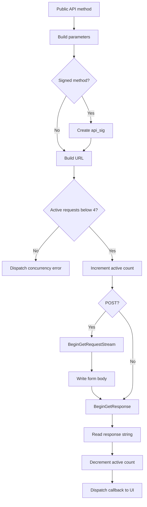

# Last.fm integration

`LastFMService` centralizes Last.fm Web Services API calls. One instance is created at `App.LastFm` and shared by all pages.

## Configuration and session

The service has two independent credential groups:

- API application: `_apiKey` and `_apiSecret`;
- user session: `_session.Username` and `_session.SessionKey`.

`Configure()` assigns the API pair in memory. `LoadSession()` and `SaveSession()` read/write only the session pair.

`IsAuthenticated` means a non-empty session key exists; it does not verify API credentials or server validity.

## Supported operations

| Method | Last.fm method | Auth/signature |
|---|---|---|
| `GetTokenAsync` | `auth.gettoken` | API signature |
| `GetSessionAsync` | `auth.getSession` | API signature |
| `UpdateNowPlayingAsync` | `track.updateNowPlaying` | Session + signature |
| `ScrobbleAsync` | `track.scrobble` | Session + signature |
| `LoveTrackAsync` | `track.love` | Session + signature |
| `UnloveTrackAsync` | `track.unlove` | Session + signature |
| `GetRecentTracksAsync` | `user.getRecentTracks` | API key |
| `GetTopArtistsAsync` | `user.getTopArtists` | API key |
| `GetTopTracksAsync` | `user.getTopTracks` | API key |
| `GetTrackInfoAsync` | `track.getInfo` | API key; optional username |

## API signatures

`ApiSignatureHelper.CreateSignature`:

1. sorts parameters by key using LINQ's default string ordering;
2. excludes keys whose name contains `format`;
3. concatenates each key immediately followed by its value;
4. appends the shared secret;
5. UTF-8 encodes the result;
6. computes MD5 using the repository's inline implementation; and
7. returns lowercase hexadecimal.

Example conceptual input:

```text
api_keyKEYartistARTISTmethodtrack.loveskSESSIONtrackTITLESECRET
```

`api_sig` is added after calculating the signature.

## URL and POST construction

`BuildRequestUrl()` adds all dictionary values as escaped query parameters and appends `format=json`.

For POST calls, the service also serializes `postData` as `application/x-www-form-urlencoded`, again appending `format=json`. Since callers build the URL from the same dictionary they pass as `postData`, POST parameters appear in both query and body.

The service uses a `WebRadioFM/1.0` user agent and accepts JSON.

## Async request pipeline



`RequestState` carries request, success/error callbacks, and a completion action that decrements `_activeRequests` under a lock.

## Error handling

### HTTP/network errors

`HandleResponse` catches `WebException`, prefixes its message with `Network error:`, then attempts to read the response body and replace the text with a parsed Last.fm API error.

Other exceptions become `Request failed: <message>`.

### API errors in successful responses

Each public callback first calls `GetErrorFromJson`. A nonzero `ErrorResponse.error` becomes:

```text
Last.fm error <number>: <message>
```

### Parse failures

Deserialization catches are empty. Each read method returns a method-specific text such as `Failed to parse top tracks`; token/session parsers return `null`, leading to a higher-level error.

## Serialization models

`DataContractJsonSerializer` deserializes API-specific response classes in `Models/LastFmResponses.cs` and `Models/LastFmStats.cs`. Streams are in-memory UTF-8 byte arrays.

The code assumes list-valued JSON members deserialize as lists. If Last.fm changes a member between object and array based on cardinality, parsing can fail.

## Concurrency and lifetime

The service caps active requests at four. This protects a constrained client but has no queue, priority, cancellation, timeout configuration, or retry/backoff.

Every started request should call `OnComplete` exactly once. Request creation/configuration happens after increment and outside a wrapping try/catch; a synchronous exception there could leave the counter elevated.

## Transport security

Both constants use HTTP. See [Privacy and security](../user-guide/privacy-security.md). Upgrading to HTTPS should include target-runtime TLS testing and should remove duplicate sensitive POST query parameters where Last.fm protocol compatibility permits.
