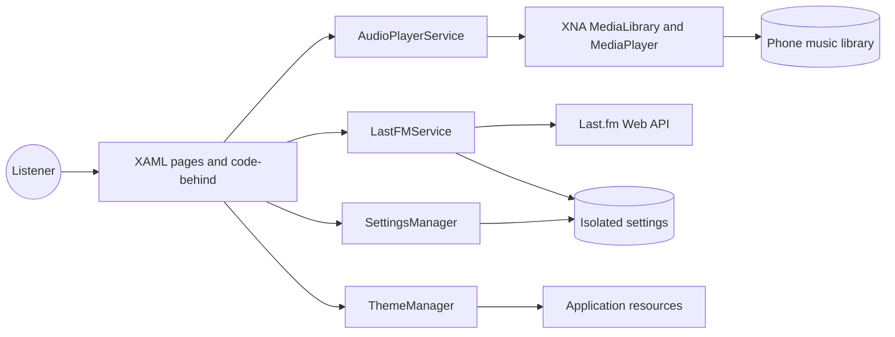
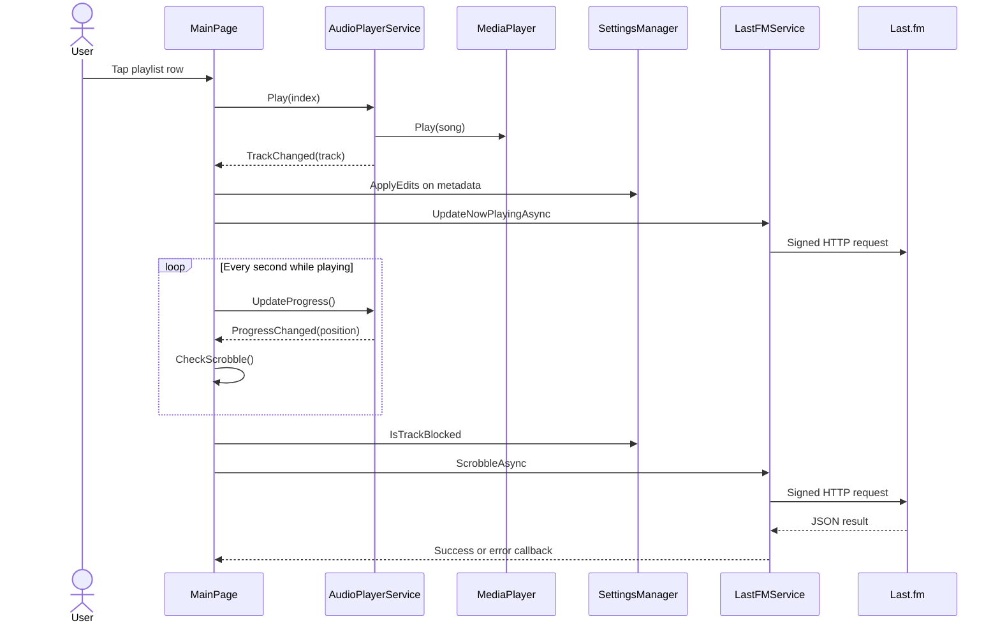

# Architecture overview

WebRadioFM is a single Windows Phone Silverlight application with three XAML pages, two services, static helpers, and serializable models. It has no dependency-injection container, database, background audio agent, or third-party package layer.

## System context

## Runtime layers

### Presentation

`MainPage`, `SettingsPage`, and `StatsPage` directly handle control events and call services/static helpers. There is no formal MVVM view-model layer. `Track` and Last.fm response models are bound directly into list controls.

### Application orchestration

Most coordination lives in code-behind:

- `App` owns global startup and `LastFMService`;
- `MainPage` owns `AudioPlayerService`, the progress timer, metadata transformations, and scrobble state;
- `SettingsPage` maps controls to persistence/authentication; and
- `StatsPage` starts and binds API requests.

### Integrations

- `AudioPlayerService` adapts static XNA media APIs into instance events/properties.
- `LastFMService` adapts the Last.fm HTTP/JSON protocol into callback methods.

### State and utility

- `SettingsManager` is a static isolated-storage facade.
- `ThemeManager` converts saved appearance choices into global resources.
- `ApiSignatureHelper` implements Last.fm signature generation.
- converters bridge Boolean properties to XAML visibility.

## Ownership and lifetime

| Object | Created by | Lifetime |
|---|---|---|
| `App.LastFm` | `App` constructor | Application process |
| `App.RootFrame` | `App.InitializePhoneApplication` | Application process |
| `AudioPlayerService` | `MainPage` constructor | Intended page lifetime; currently not disposed by page |
| progress `DispatcherTimer` | `MainPage` constructor | Page instance; starts on first track |
| settings/theme static classes | CLR | Process |
| response models | `DataContractJsonSerializer` | Request callback |

Because `MediaPlayer` events are static, `AudioPlayerService.Dispose()` matters. `MainPage` currently does not call it or detach its own delegates, so recreated page instances can remain subscribed.

## Main playback-to-scrobble path

## Threading model

Silverlight UI objects must be updated on the UI thread.

- Page event handlers and `DispatcherTimer` ticks run on the UI dispatcher.
- `HttpWebRequest` async callbacks run away from the UI thread.
- `LastFMService.HandleResponse` uses `Deployment.Current.Dispatcher.BeginInvoke` before invoking page callbacks.
- POST request-stream failures also dispatch errors.
- `AudioPlayerService.Play()` dispatches `MediaPlayer.Play` and related event notification.

Callbacks are `Action` delegates rather than `Task`; there is no cancellation token or request ownership by page.

## External boundaries

### Phone media library

The manifest grants audio-library and playback capabilities. The application copies metadata into `Track` objects but plays the original XNA `Song` instances by index.

### Last.fm

All API interactions are centralized in `LastFMService`. Read-only statistics use unsigned GET requests with an API key. Authentication and mutating track methods use an MD5 `api_sig`; session methods also carry `sk`.

### Isolated storage

Preferences and session identity are process-independent. There is no encrypted secret store, transaction layer, or app-level settings export.

## Design tradeoffs

| Choice | Benefit | Cost |
|---|---|---|
| Code-behind orchestration | Small, direct codebase | UI, policy, and service timing are tightly coupled |
| Static XNA player | Native WP media integration | Global events and index synchronization complexity |
| Callback HTTP | Compatible with legacy platform | Nested control flow, no cancellation, easy lifetime leaks |
| Data contracts | No external JSON dependency | API shape changes can silently fail parsing |
| Isolated settings | Simple persistence | Weak schema/versioning and no secure credential abstraction |
| Inline MD5 | No cryptography package dependency | More code to verify and maintain |

Continue with [Application lifecycle](./application-lifecycle.md) or a subsystem-specific page.
