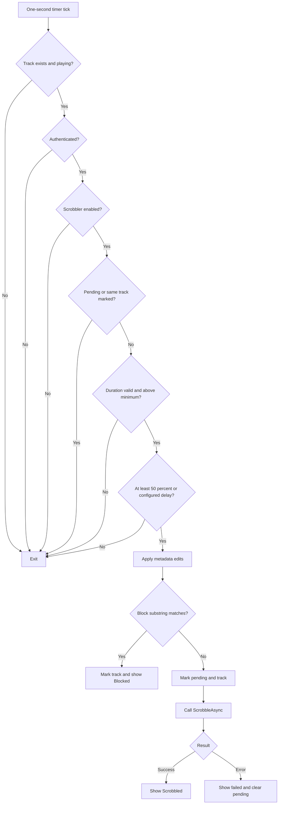

# Scrobble pipeline

Scrobbling is orchestrated by `MainPage`, not `LastFMService`. The page decides **whether and when** to submit; the service only validates authentication and performs the signed request.

## Per-play state

```csharp
private Track _currentScrobbledTrack;
private DateTime _playStartTime;
private bool _scrobblePending;
private bool _isLoved;
```

On every `TrackChanged` event, the page:

1. transforms and displays metadata;
2. resets progress;
3. sets `_currentScrobbledTrack = null`;
4. sets `_scrobblePending = false`;
5. captures `DateTime.Now` as `_playStartTime`;
6. resets/later optionally applies auto-love;
7. starts the timer;
8. sends Now Playing; and
9. refreshes status.

## Decision flow



## Timing source

The page polls rather than responding to a dedicated playback-position event stream. Every timer tick calls `AudioPlayerService.UpdateProgress()`, which emits only when `_isPlaying` is true.

`CheckScrobble()` independently reads `Position` and `Duration`. It uses media position, not elapsed wall-clock time, for eligibility.

The timestamp sent to Last.fm uses wall-clock `_playStartTime`, set when track change is reported. It is converted to UTC Unix seconds by `LastFMService.ToUnixTimestamp`.

## Metadata boundary

The same `SettingsManager.ApplyEdits` operation feeds:

- main-page Now Playing labels;
- Last.fm Now Playing;
- blocking; and
- Last.fm scrobble.

Love/unlove calls use `_player.CurrentTrack.Artist` and `Title` directly in the manual heart handler, while auto-love in `OnTrackChanged` uses transformed `artist` and `title`. This means the two paths can target different Last.fm track strings when edit rules exist.

## Duplicate prevention

The page compares `Track` objects by reference. Once `_currentScrobbledTrack` is assigned the active object, timer ticks exit until a future `TrackChanged` resets it.

Assignment occurs before the request completes. This prevents duplicates while in flight and after success. On failure, only `_scrobblePending` resets, so the object-reference guard also prevents the intended retry.

## Block behavior

A blocked play sets both `_scrobblePending = true` and `_currentScrobbledTrack = currentTrack`. No network call is made. The pending flag is never reset for that active track, which intentionally prevents repeated block checks.

Now Playing is sent earlier on track change and is not subject to the block list.

## State reset scenarios

| Scenario | Reset? |
|---|---|
| Select another track | Yes, through `TrackChanged` |
| Next/Previous starts another track | Yes |
| Restart same index with Previous after 3 s | Yes because `Play()` raises `TrackChanged` |
| Pause/resume | No |
| Navigate to Settings and back | No |
| Scrobble request fails | Pending only; marked track remains |
| App process recreated | Main page and all per-play state recreated |

## Improving the pipeline

A more testable design would extract a scrobble policy with inputs (position, duration, settings, metadata, prior state) and a deterministic decision result. Request state could use an enum such as `NotEligible`, `Ready`, `Submitting`, `Submitted`, `Blocked`, and `FailedRetryable`, rather than two Booleans and a reference.
