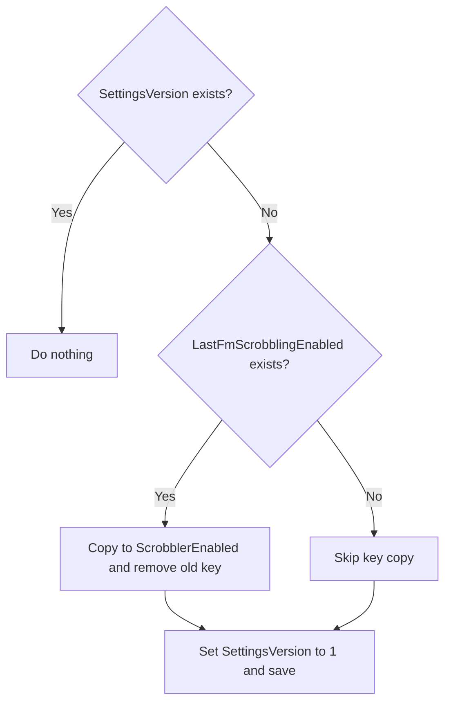

# Settings and storage

WebRadioFM uses `IsolatedStorageSettings.ApplicationSettings`, a key/value dictionary scoped to the installed application.

## Preference keys

| Key | Type | Default | Setter behavior |
|---|---|---|---|
| `ScrobblerEnabled` | `bool` | `true` | Direct |
| `NowPlayingEnabled` | `bool` | `true` | Direct |
| `ScrobbleDelaySecs` | `int` | `180` | Clamped 30–360 |
| `ScrobbleDelayPercent` | `int` | `50` | Clamped 30–95 |
| `MinTrackDuration` | `int` | `30` | Clamped 10–60 |
| `FetchAlbumArt` | `bool` | `false` | Direct |
| `ThemeName` | `string` | `Default` | Direct; theme lookup falls back |
| `ThemeIsDark` | `bool` | `true` | Direct |
| `LoveOnStartup` | `bool` | `false` | Direct |
| `RegexRules` | `List<MetadataEditRule>` | empty | Replaced as a list |
| `BlockedTracks` | `List<string>` | empty | Replaced as a list |
| `SimpleEdits` | `List<MetadataEditRule>` | empty | Replaced as a list |

Every setter writes the value and calls `Save()` immediately inside a silent try/catch.

## Session keys

`LastFMService` manages two additional keys:

| Key | Type | Purpose |
|---|---|---|
| `LastFmSessionKey` | `string` | Authenticated Last.fm session |
| `LastFmUsername` | `string` | Account used for statistics |

They are saved together after `auth.getSession` and removed together by `ClearSession()`.

`ApiKey` and `ApiSecret` are not stored.

## Read behavior

The generic helper is conceptually:

```csharp
if (settings.Contains(key))
    return (T)settings[key];
return defaultValue;
```

All exceptions are caught and return the default. A stale value with the wrong runtime type therefore behaves as missing.

Getters do not normalize already-stored numeric values through the setter clamp. If isolated storage contains an out-of-range integer written by an older build or external tooling, the getter returns it directly.

## Migration

`UpgradeSettings()` implements schema version 1:



The migration assumes the old key is a `bool`; an incompatible type could throw because this method has no surrounding catch. `App` calls it during construction.

Future migrations should compare an integer version and apply every intermediate step rather than only checking key presence.

## Metadata rule persistence

`MetadataEditRule` has public properties and a parameterless constructor so isolated settings can serialize it. Fields are:

- `Field`
- `Pattern`
- `Replacement`
- `Enabled`
- `Description`

Settings UI creates rules with `Enabled = true`; transformation currently ignores `Enabled` and `Description`.

## Storage lifecycle

- Page control changes save immediately for switches/sliders/themes.
- Multiline block/edit text saves only when its explicit button is tapped.
- App deactivation/closing does not run an additional flush.
- Package update generally retains settings.
- Uninstall generally removes isolated storage.

## Failure visibility

Read/write/session exceptions are swallowed, so the UI can appear to save while persistence failed. In a diagnostic build, add logging or breakpoints inside catches without logging secret values.

## Security posture

Isolated application settings are convenient persistence, not an application-managed encrypted vault. Session keys are sensitive. See [Privacy and security](../user-guide/privacy-security.md).
