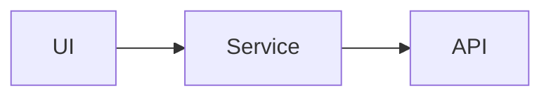

# Documentation development

The handbook is a Docusaurus 3.10.2 site at repository root. It is independent of the Windows Phone compiler and can run on any platform supported by Node.js.

## Prerequisites

- Node.js 20 or later
- npm (lockfile-based installs are preferred in CI)

Check versions:

```bash
node --version
npm --version
```

## Install and run

```bash
npm install
npm start
```

The development server binds to `0.0.0.0` and serves the site at:

```text
http://localhost:3000/
```

Development uses `/` for convenient local and hosted previews. Production builds default to the GitHub Pages project path `/WebRadioFM/`.

Changes to Markdown, React, CSS, sidebars, and config hot-reload.

## Production build

```bash
npm run build
npm run serve
```

Generated output is written to `build/` and ignored by Git. `npm run build` is the required validation step before review.

Other scripts:

| Command | Purpose |
|---|---|
| `npm start` | Development server with live reload |
| `npm run build` | Static production output |
| `npm run serve` | Serve existing production output |
| `npm run clear` | Clear Docusaurus caches/generated state |
| `npm run swizzle` | Eject/wrap theme components (use sparingly) |
| `npm run deploy` | Docusaurus's direct deployment helper |

## Content organization

```text
docs/
├── getting-started/    onboarding, requirements, install
├── user-guide/         task and behavior documentation
├── development/        build, contribution, release, docs
├── architecture/       subsystem design and flows
└── api-reference/      class/member contracts
```

`sidebars.js` defines a user guide and developer guide over the same docs plugin. Every new page must either be added to a sidebar or intentionally linked from another page.

## Writing rules

- Use Markdown (`.md`) unless React/MDX is necessary.
- Include `title` and `description` front matter.
- Prefer relative links between docs.
- Use code fences with a language (`csharp`, `xml`, `powershell`, `text`).
- Use Mermaid for flows that are clearer as diagrams.
- Mark historical constraints with `:::warning` and sensitive behavior with `:::danger`.
- Distinguish current behavior, known issues, and proposed improvements.
- Use source identifiers exactly as spelled in code.

## Site code

| Path | Purpose |
|---|---|
| `docusaurus.config.js` | URLs, docs preset, Mermaid, navigation, footer, Prism |
| `sidebars.js` | Sidebar trees |
| `src/pages/index.js` | Custom project landing page |
| `src/pages/index.module.css` | Landing-page scoped styles |
| `src/css/custom.css` | Site-wide theme tokens and docs styles |
| `static/img/` | Logo, favicon, social card |
| `.github/workflows/documentation.yml` | CI build and GitHub Pages deployment |

## Base URL

Production uses `/WebRadioFM/`. Override it when hosting at a domain root:

```bash
DOCUSAURUS_BASE_URL=/ npm run build
```

The value must start and end with `/`.

## Links and source editing

`onBrokenLinks: 'throw'` makes unresolved routes fail production builds. The **Edit this page** links target the repository's `main` branch. If the default branch or repository owner changes, update `repositoryUrl`, `url`, `baseUrl`, `organizationName`, and `projectName` together.

## Mermaid

Mermaid is enabled through `@docusaurus/theme-mermaid`:

````markdown

````

Keep labels concise and build after diagram edits; invalid Mermaid can fail or break rendering.

## GitHub Pages deployment

The Documentation workflow:

1. runs on relevant pull-request and `main` path changes;
2. installs Node 22 and dependencies with `npm ci`;
3. runs the static build;
4. uploads `build/`; and
5. deploys it with `actions/deploy-pages` for non-PR events.

Repository administrators must configure **Settings → Pages → Source: GitHub Actions**. Pull requests build but do not deploy.

## Updating dependencies

Keep all Docusaurus packages on the same exact version. After updates:

```bash
npm install
npm run clear
npm run build
```

Commit `package.json` and `package-lock.json` together. Review Docusaurus migration notes before major-version upgrades.
