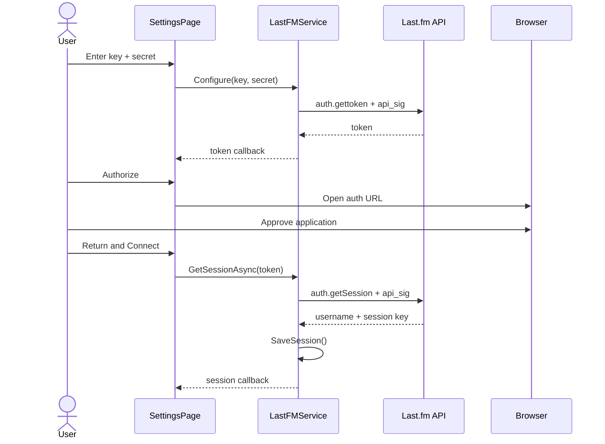

# Connect Last.fm

WebRadioFM uses Last.fm's desktop authentication flow: request a token, authorize it in a browser, then exchange it for a session key.

## Create API credentials

1. Sign in to Last.fm.
2. Open [Create API account](https://www.last.fm/api/account/create).
3. Register an application.
4. Copy the **API key** and **shared secret**.

The Last.fm API key identifies the API application. The shared secret is appended to sorted request parameters and MD5-hashed to create `api_sig`; it must not be posted publicly.

## Connect in WebRadioFM

Navigate to **settings → scrobbling → Accounts**.

### 1. Request a token

Enter the API key and secret, then tap **get token**. WebRadioFM calls `auth.gettoken` with a signed GET request. A successful JSON response contains a token, which is copied into the token field.

### 2. Authorize the token

Tap **authorize**. A `WebBrowserTask` opens this URL:

```text
http://www.last.fm/api/auth/?api_key=YOUR_KEY&token=THE_TOKEN
```

Sign in if required and approve the request. Then return to WebRadioFM.

### 3. Exchange it for a session

Confirm the same token is present and tap **connect**. The app calls `auth.getSession`. On success it retains:

- the Last.fm username; and
- the session key used as `sk` on authenticated API methods.

The status changes to **Connected as _username_**.

## What is persisted

`LastFMService.SaveSession()` writes only these isolated-storage keys:

| Key | Value |
|---|---|
| `LastFmSessionKey` | Authorized session key |
| `LastFmUsername` | Last.fm account name |

The API key and shared secret are fields on the in-memory service and are **not saved**. After process recreation, `App` loads the session but leaves `ApiKey` and `ApiSecret` empty. Re-enter credentials before calls that require API signing.

:::danger Transport security
The source uses `http://ws.audioscrobbler.com/2.0/` and `http://www.last.fm/api/auth/`. Requests can contain a session key and API signature. Avoid untrusted networks and consider migrating both constants to supported HTTPS endpoints before using real credentials.
:::

## Disconnect

Tap **disconnect** to:

- replace the in-memory session with an empty `LastFmSession`;
- remove `LastFmSessionKey` and `LastFmUsername`; and
- clear the token field and disable authorization/connect controls.

Disconnect does not revoke the Last.fm session server-side. Revoke application access through Last.fm account settings if server-side invalidation is required.

## Authentication sequence



## Troubleshooting

| Message or symptom | Likely cause / action |
|---|---|
| “Enter your Last.fm API key and secret first.” | One credential field is empty. |
| “Get a token first.” | The in-memory `_currentToken` is null; request a new token. |
| Authorization button disabled | Request a token first, or return with a non-empty token field. |
| Invalid API key/signature | Verify the key/secret pair and remove accidental whitespace. |
| Authentication failed | Approve the token before connecting; request a fresh token if it expired. |
| Connected status but API requests fail after relaunch | Re-enter the API key and secret; the session alone does not repopulate credentials. |
| “Too many concurrent requests” | Wait for one of the maximum four in-flight requests to complete. |
