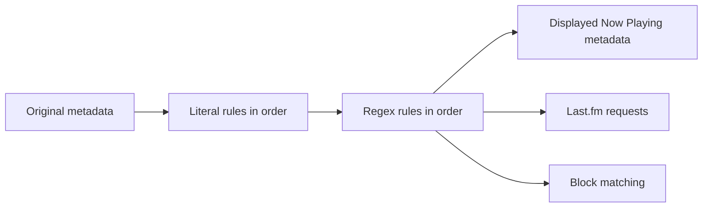

# Metadata edits and blocking

Rules change the metadata sent to Last.fm without modifying files in the phone's music library.

## Supported fields

A rule's field must be one of:

- `title`
- `artist`
- `album`
- `all`

Matching is a case-sensitive string comparison in code. Use lower-case field names exactly as shown. An unknown or differently-cased field is saved but never applied.

## Literal edits

Enter one rule per line in **Metadata Edits**:

```text
field:pattern:replacement
```

Examples:

```text
title: (Explicit):
artist:The Beatles:Beatles
all:  : 
```

The parser splits each line at most twice, so the replacement may contain colons. The pattern cannot contain a colon without becoming part of the replacement. Whitespace around each parsed component is trimmed.

Literal edits use `string.Replace`, so they are:

- case-sensitive;
- global within the string; and
- applied in displayed/saved order.

Rules with an empty pattern are discarded when Save is tapped.

## Regular-expression rules

Enter regex rules with the same three-part format:

```text
field:pattern:replacement
```

Examples:

```text
title:\s*\(feat\.[^)]+\):
title:^\d+\s*-\s*:
artist:\s+&\s+:
all:\s{2,}: 
```

The implementation uses .NET `Regex.Replace`. Capture groups can be referenced in replacements:

```text
title:^(.*) \[Live\]$:$1
```

:::caution Colon delimiter
The settings parser always uses `:` as its delimiter. Regex constructs or replacements containing colons cannot be represented reliably with this input format because the line is split into only `field`, `pattern`, and the remaining `replacement`.
:::

Invalid regular expressions are silently skipped at application time. They remain saved, and the settings screen does not display a validation error.

## Order of operations

For each field, `SettingsManager.ApplyEdits(text, field)` does:



Rules apply to the output of preceding rules. Reordering entries can change the result.

The `Enabled` property on `MetadataEditRule` is currently not consulted by `ApplyEdits`; every saved rule is executed if its field matches.

## Blocked metadata

Enter one artist/title fragment per line in **Blocked Metadata**, for example:

```text
podcast
white noise
artist name - demo
```

After edits, the app lowercases both the combined `artist - title` string and each blocked line. If any line is a substring, the scrobble is blocked.

Consequences:

- matching is case-insensitive;
- regular expressions are not supported in the block list;
- album text is not considered;
- broad entries can block more tracks than intended; and
- blocking affects scrobbles, not local playback or Now Playing submission.

## Suggested workflow

1. Add one rule at a time.
2. Tap the relevant **save** button; leaving the page alone does not parse text-box edits.
3. Select a different track to trigger transformed Now Playing text.
4. Confirm the title/artist/album displayed in the player.
5. Review Last.fm after the scrobble threshold.
6. Keep patterns narrow and preserve a copy before experimenting with complex regex.

## Storage format

The app saves `List<MetadataEditRule>` and `List<string>` directly in `IsolatedStorageSettings`. There is no import/export UI. Uninstalling the app removes these rules.
